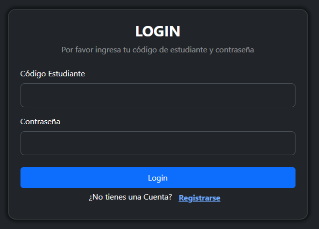
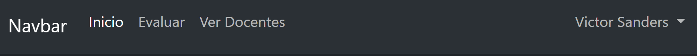
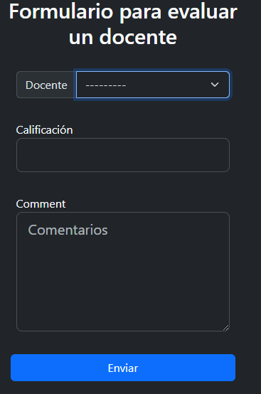
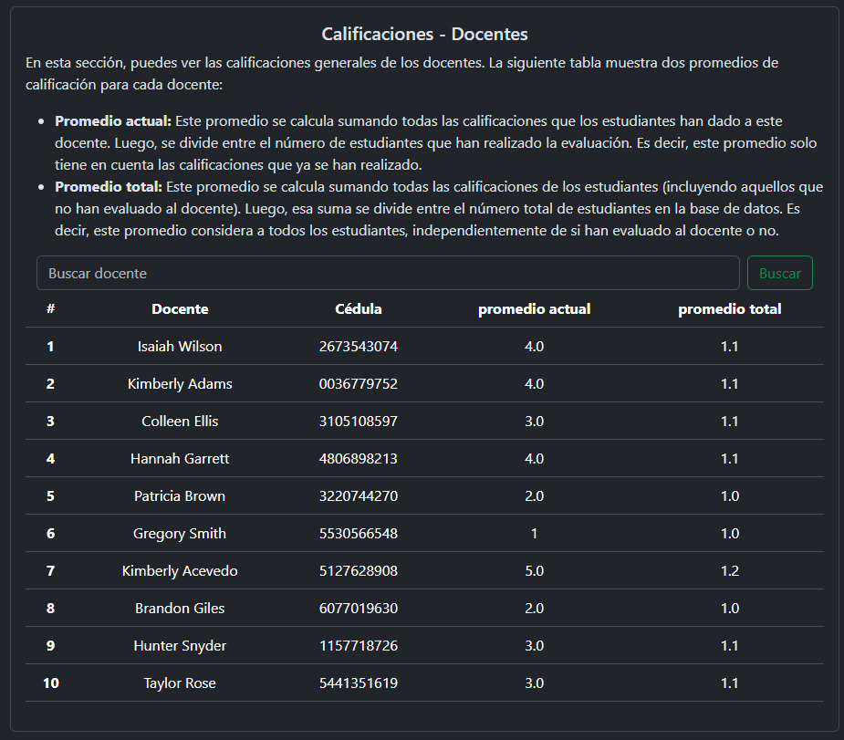
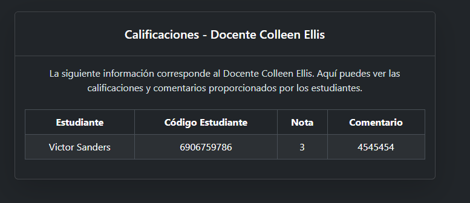

# 📌 Módulo de Evaluaciones - Instalación y Uso

_Esta es la solución para la prueba técnica de Django._
Este proyecto, busca crear una aplicación web sencilla pero eficiente que permite a los estudiantes evaluar un docente por medio de una calificación y un comentario. También se desea implementar un formulario para registro e inicio de sesión manteniendo buenas practicas de código.

## 🛠 Instalación

### - Opción 1: Descargar archivo ZIP

1. **Descargar** el archivo ZIP adjunto en el correo.
2. **Descomprimir** el archivo ZIP.
3. **Abrir el proyecto** con el editor de código que prefiera.

### - Opción 2: Clonar el repositorio

Todos lo realizado para la solución esta en el siguiente repositorio 🔗 [Repositorio GitHub](https://github.com/JulianD1997/modulo_evaluaciones.git)
Para clonar el repositorio, ejecuta los comandos en la terminal:

```bash
# clonar el repositorio
git clone https://github.com/JulianD1997/modulo_evaluaciones.git
# Ingresar a la carpeta del repositorio
cd modulo_evaluaciones
# opcional, abrir el proyecto con vs
code .
```

--

### Creación y activación del entorno virtual

Recomiendo usar un entorno virtual para gestionar las dependencias del proyecto Comandos para sistemas operativos
**Linux/MacOS**

```bash
# crear entorno virtual
python3 -m venv .venv
# activar entorno virtual
source .venv/bin/active
```

**Windows(CMD)**

```cmd
python -m venv .venv
.venv\Scripts\activate
```

-

### Instalar dependencias, configuracion del proyecto y arranque de servidor

Para el siguiente instalaremos las dependencias que necesita el proyecto

```bash
# instalación del dependencias
pip install -r requirements.txt
# Configuración del proyecto
python manage.py migrate
# Arranque de servidor
python manage.py runserver
```

---

## 🔑 Datos de Importancia

Actualmente en la base de datos del proyecto existen:

- 20 estudiantes
- 10 docentes

Para autenticarse deberá ingresar código de estudiante y contraseña

### Datos de Prueba

- Todos los estudiantes creados para la prueba comparten la misma contraseña
- Puede elegir cualquier **codigo** de la siguiente lista para iniciar sesión.
  | Código de Estudiante | Contraseña |
  |----------------------|------------|
  | 6906759786 | Admin1234+ |
  | 3541964109 | Admin1234+ |
  | 7451321601 | Admin1234+ |
  | 0051899710 | Admin1234+ |
  | 8979795514 | Admin1234+ |
  | 7287476937 | Admin1234+ |
  | 5579318715 | Admin1234+ |
  | 5954741556 | Admin1234+ |
  | 3020943686 | Admin1234+ |
  | 1638611196 | Admin1234+ |
  | 4680451496 | Admin1234+ |
  | 5667079030 | Admin1234+ |
  | 6161497153 | Admin1234+ |
  | 4663424313 | Admin1234+ |
  | 7751370110 | Admin1234+ |
  | 6892247007 | Admin1234+ |
  | 3368082186 | Admin1234+ |
  | 0094005623 | Admin1234+ |
  | 3497095338 | Admin1234+ |
  | 5958584957 | Admin1234+ |
  | 1234567890 | Admin1234+ |

---

## ✏️ Pruebas

### Login(Inicio de sesión)

Acceder al login, Abrir en el navegador y acceder a la ruta:
**http://127.0.0.1:8000** [Localhost:8000](http://127.0.0.1:8000/)

- Acceder a esta ruta será redirigido automáticamente a la ruta `/login/`, ya que se requiere autenticación para acceder a otras páginas.
- Vista Login en la página de inicio de sesión, encontrarás dos campos:



1. **Código Estudiante**
2. **Contraseña**

Puedes completar los campos con los datos ofrecidos en la parte de arriba
cuando se llenan ambos campos, dar clip en el botón **Login**

- ✅ Si los campos están correctamente → redirige a la página de inicio
- ❌ Si los campos son incorrectos → muestra mensajes indicando el error.

### Opcional

si el estudiante no tiene cuenta puede crear una nueva haciendo clip en **<ins>Registrar</ins>**

---

### Inicio

Acceder desde la barra de navegación o ir a la dirección `http://127.0.0.1:8000/`
página de inicio de la aplicación actualmente no tiene contenido, pero en ella se puede observar una barra de navegación en la parte superior:

Barra de navegación:


- **Inicio** → Página actual.
- **Evaluar** → Para calificar un docente.
- **Ver Docentes** → Para ver un listado de todos los docentes
- **Nombre de estudiante** al hacer clip se desplegará un submenú para cerrar sesión.

---

### Evaluar

Acceder desde la barra de navegación o ir a la dirección `http://127.0.0.1:8000/docente/evaluar/`

Formulario:


- **lista desplegable** en ella se puede seleccionar el docente que se quiere calificar. Esta lista solo mostrará los docentes que hacen falta por calificar para el estudiante que inicio sesión
- **Calificación** campo para ingresar la nota que desea evaluar en el rango de 1 a 5
- **Comentarios** este Campo es requerido, necesita ingresar un comentario.

Cuando se complete el formulario le daremos clip en el botón enviar

- ✅ Si los campos están correctamente → Guarda la evaluación y se actualiza la lista desplegable(ya no mostrará el docente calificado)
- ❌ Si los campos son incorrectos → muestra mensajes de error. Puede indicar que no se permiten calificaciones menores a 1 o mayores a 5, debe ser un número entero. Seleccionar docente, o que el campo de comentarios está vació.

--

## Ver Docentes

Acceder desde la barra de navegación o ir a la dirección `http://127.0.0.1:8000/docentes/listado/`
Listado docente:

En esta vista usted podrá observar todos los docentes que están guardados en la base de datos. Esta lista costa de 4 campos.

- **#** ID del docente
- **Docente** Nombre del Profesor
- **Cédula** Cédula del Docente
- **Promedio actual** Promedio actual, suma total de notas divido en el total de
  estudiantes que calificaron hasta el momento
- **promedio total** Promedio total, suma total de notas divido en el total de estudiantes en la base de datos, las notas que no se han realizado se toman como la nota mas baja posible(1).

Se puede buscar un docente por su nombre o apellido para mayor facilidad, además usted puede darle clip a la fila(casilla) de docente que usted quiera ver las calificaciones realizadas a ese profesor.

### Ver Evaluaciones

Acceder desde la lista de docentes, dando clip en la lista, al docente que desea observar o ir a la dirección `http://127.0.0.1:8000/docentes/{id}/evaluaciones/` ingresando el, id de docente que quiere mirar. En esta página se puede observar toda la información de las calificaciones que se le realizaron al docente seleccionado.
Listado Evaluaciones:


- **tabla de contenido**
  - **Estudiante** Nombre de estudiante
  - **Código Estudiante** Código del estudiante
  - **Nota** calificación realizada por ese estudiante.
  - **Comentario** Comentario realizado por ese estudiante

En dado caso el docente no haya recibido calificaciones se mostrara un mensaje indicando que No hay evaluaciones disponibles.

--

# 📌 Módulo de Evaluaciones - Documentación de Desarrollo

Este apartado describe el desarrollo de la prueba técnica, su finalidad, configuración, soluciones implementadas, bloqueos encontradas y mejoras propuestas para futuras versiones.

### Buenas practicas

- se usaron variables en ingles para evitar errores con caracteres especiales del español
- se utilizo el patron **Modelo-Vista-Template** de Django.

--

## ⚙️ Configuración Proyecto principal

Estructura de carpetas

```bash
modulo_evaluaciones/
│── assessment_module/ # carpeta con archivos principales .
│──│── settings.py # configuración del proyecto
│──│── urls.py # Rutas principales del proyecto
│── assessments/
│── templates/
│──│── base_html.html # Plantilla base HTML
│── static/ # Archivos estáticos (CSS, JS)
```

### Entorno virtual

Se utilizó un entorno virtual para evitar conflictos con otros proyectos y administrar las dependencias de manera aislada.

```bash
# crear entorno virtual
python3 -m venv. venv
# activar entorno virtual
source .venv/bin/active
```

### settings.py

- **Registro** de la aplicación en INSTALLED_APPS

  ```python
  INSTALLED_APPS = [
    ...,
      # se agrega proyecto de evaluaciones
      "assessments",
  ]
  ```

- Se utilizó SQLite como base de datos, dado que es un proyecto de prueba, obviamente para producción, se recomienda un motor de base de datos más robusta.

  ```python
  DATABASES = {
      "default": {
          "ENGINE": "django.db.backends.sqlite3",
          "NAME": BASE_DIR / "db.sqlite3",
      }
  }
  ```

- Se configuró el sistema de autenticación igualmente para redireccionamientos

  ```python
  # Se cambia el modelo de autenticación por el modelo de Estudiante
  AUTH_USER_MODEL = "assessments.Student"
  # Url para login
  LOGIN_URL = "/login/"
  # Cuando se este abierta la sesión se dirige a la pagina principal
  LOGIN_REDIRECT_URL = "/"
  # Cuando se cierra sesión vuelve a la ruta de Login
  LOGOUT_REDIRECT_URL = "Login"
  ```

- Se definen rutas para templates y archivos estáticos

  ```python
  TEMPLATES = [
      {
        ...,
          # ruta para las carpetas templates
          "DIRS": [
              os.path.join(BASE_DIR, "templates"),
              os.path.join(BASE_DIR, "assessments", "templates"),
          ],...
      }
  ]
  # Se agrega la ruta para los archivos estáticos CSS y JS
  STATICFILES_DIRS = [os.path.join(BASE_DIR, "static")]
  STATIC_URL = "static/"
  STATIC_ROOT = os.path.join(BASE_DIR, "staticfiles")
  ```

--

### urls.py

- Se incluyen las rutas de la aplicación assessments dentro de las URLs principales
- Como buena práctica, cada aplicación debería manejar sus propias rutas. Es por ello que se incluyen.

```python
urlpatterns = [
    ...,
    # se agrega las rutas de la app de evaluaciones
    path("", include("assessments.urls")),
    ...,
]
```

--

### templates(Platillas)

- Se creó una plantilla base para evitar repetir código en cada vista. Como proyecto principal se deja la plantilla base para que pueda tener la misma apariencia.

### static (archivos CSS y JS)

- **bloqueo 1**: Estilización del Proyecto Principalmente había instalado la dependencia Bootstrap para Django, pero algunos archivos, sobre todo JavaScript no funcionaban correctamente. Para solucionar esto:
  - Descargue los archivos CSS y JSS de Bootstrap.
  - Cargue la carpeta static para garantizar un correcto funcionamiento.

Básicamente, esta es la estructura del proyecto principal.

## Aplicación assessments

Estructura de carpetas

```bash
assessments/
│── migrations/ # Migraciones de la base de datos
│── templates/ # Plantillas HTML
│── static/ # Archivos estáticos (CSS, JS)
│── forms.py # Formularios
│── models.py # Modelos de base de datos
│── views.py # Lógica de las vistas
│── urls.py # Rutas de la aplicación
│── tests.py # Pruebas automáticas
```

--

### template (plantillas)

- assessment_page.html → Formulario de evaluación docente
- home_page.html → Página de inicio
- login_page.html → Formulario de inicio de sesión
- register_page.html → Formulario de registro de estudiantes
- teacher_assessments_page.html → Calificaciones de un docente específico
- view_assessment_page.html → Lista de docentes con su promedio actual

Mejoras propuestas:

- Crear una plantilla base especifica para la aplicación assessments con la barra
  de navegación incluida.
- Evaluar el uso de Tailwind CSS en lugar de bootstrap para mejorar el rendimiento.

--

## Forms.py (Formularios)

**`StudentCreateForm`**
Formulario para crear estudiante.

- Incluye un campo `confirm_password` para validar la contraseña
- Se agregan clases bootstrap a los inputs inputs para estilización por medio del constructor
  ```python
  def __init__(self, *args, **kwargs):
          super(StudentCreateForm, self).__init__(*args, **kwargs)
          # Asignar la clase CSS 'form-control form-control-lg' a los campos de texto
          for field in self.fields.values():
              field.widget.attrs["class"] = (
                  field.widget.attrs.get("class", "") + " form-control form-control-lg"
              )
  ```
- Se sobrescribe el método save para encriptar la contraseña antes de guardarla.

**`LoginForm`**
Formulario para iniciar sesión

- Se validan los inputs para evitar caracteres especiales en campos numéricos.
- Se añaden clases de bootstrap para una mejor presentación.
  ```python
  validators=[
              RegexValidator(
                  r"^\d{1,10}$", "El código deber ser un numero de max 10 dígitos"
              )
          ],
  widget=forms.TextInput(attrs={"class": "form-control form-control-lg"}),
  ```

**`AssessmentForm`**
Formulario para evaluar docentes:

- incluye un campo **rating** validado para aceptar solo valores enteros entre 1 y 5.
- Contiene un campo **comment** para las observaciones.
- Se implementa un select dinámico que solo muestra los docentes que aún no han sido calificados por el estudiante.
  ```python
  def __init__(self, *args, **kwargs):
    # Para evitar que el estudiante escoja un docente que ya haya sido evaluado
    # Se filtran los docentes que ya han sido evaluados
    if "initial" in kwargs:
        student = kwargs["initial"]["student"]
    else:
        student = None
    super(AssessmentForm, self).__init__(*args, **kwargs)
    print(student)
    if student:
        print("entro")
        excluded_teacher = Assessment.objects.filter(student=student).values_list(
            "teacher", flat=True
        )
        self.fields["teacher"].queryset = Teacher.objects.exclude(
            id__in=excluded_teacher
        )
  ```

-**Bloqueo 2** Select dinámico
Me encontré un problema al inicializar el select dinámico. Para solucionarlo:

- Se depuró con `print()` y documentación oficial de Django

Plantee esta modificación de form para que excluya a los docentes ya calificados por el estudiante, con ello evitar posibles erres como que el docente ya fue calificado.

--

## Models.py (Modelos)

**`Student`**
Modelo para estudiantes.

- Hereda de User de django
- Se elimina el campo username, usando code como identificador único
  ```python
    USERNAME_FIELD = "code"
  ```
- Se usa UUID en lugar de ID numérico para mayor seguridad
  ```python
    id = models.UUIDField(primary_key=True, default=uuid.uuid4, editable=False)
  ```
- Se agregan campos adicionales como birth_date.

**`Teacher`**
modelo para Docentes

- Incluye first_name, last_name y dni (validado entre 8-10 caracteres).
  ```python
    validators=[
            RegexValidator(
                r"^\d{8,10}$", "La cédula deber ser un numero de max 10 dígitos"
            )
        ],
  ```
- Representación del objeto con **\_\_str\_\_**
  ```python
      def __str__(self):
          return f"{self.first_name} {self.last_name}"
  ```

**`Assessment`**
Modelo para evaluaciones

- rating: Número entero entre 1 y 5.
- comment: Comentarios
- Restricción para evitar calificaciones duplicadas de un estudiante a un docente.
  ```python
  class Meta:
        # Se asegura que un estudiante solo pueda calificar una vez a un profesor
        constraints = [
            models.UniqueConstraint(
                fields=["student", "teacher"], name="unique_assessment"
            )
        ]
  ```

-**Bloqueo 3**: Restricción de Evaluaciones:
Inicialmente quería implementar una clave compuesta(id_student, id_teacher), pero Django recomienda usar constraints para definir esta restricción.

--

## tests.py

Se crearon un par de pruebas básicas para verificar el almacenamiento de estudiantes y docentes, se uso Faker para generar datos aleatorios en las pruebas.

- **Mejoras Propuestas**
  - Implementar mas pruebas unitarias.

## views.py

**`student_login`**

- valida que el código y contraseña sean correctos
  ```python
  if form.is_valid():
              code = form.cleaned_data["code"]
              password = form.cleaned_data["password"]
              # Se autentica el estudiante
              student = authenticate(request, code=code, password=password)
              # Si se pudo loguear se redirige a la página principal
              if student is not None:
                  login(request, student)
                  return redirect("Home")
              else:
                  form.fields["password"].error_messages = {
                      "invalid": "Contraseña incorrecta"
                  }
                  form.add_error("password", "Código o Contraseña incorrecta")
  ```
- Renderiza la plantilla login_page.html

**`student_register`**

- Verifica que todos los datos ingresados cumplan con los requisitos.
- Renderiza la plantilla register_page.html

**`home_page`**

- Renderiza la página de inicio.

**`assessment_create`**

- Verifica que el formulario sea valido
- Envía el argumento del estudiante actual al formulario para omitir los docentes ya calificados.
  ```python
    form = AssessmentForm(initial={"student": request.user})
  ```
- Renderiza el formulario de evaluación docente.

**`view_assessments`**

- Obtiene la lista de docentes con su promedio actual y total.

  ```python
    for teacher in teachers:
        # Calculo promedio actual
        current_avg_data = Assessment.objects.filter(teacher=teacher).aggregate(
            rating_avg=Avg("rating"), total=Count("rating")
        )
        current_avg = current_avg_data["rating_avg"] or 1
        # Esta variable se puede usar para comparar los estudiantes que han realizado la evaluación
        total_ratings = current_avg_data["total"]
        sum_missing_ratings = students_count - total_ratings

        """ Calculo promedio total, aunque no hayan calificado se tiene en cuenta
        en este calculo las calificaciones que no se han hecho se tienen en cuenta
        como la calificación mas baja posible """
        total_avg = round(
            (
                ((current_avg + sum_missing_ratings) / students_count)
                if students_count > 0
                else 1
            ),
            1,
        )
        # Datos para la lista de Docentes
        teacher_data.append(
            {
                "teacher": teacher,
                "current_avg": current_avg,
                "total_avg": total_avg,
            }
        )
  ```

- Permitir filtrar docentes por su nombre o apellido.
  ```python
  teachers = Teacher.objects.filter(
            Q(first_name__istartswith=query) | Q(last_name__istartswith=query)
        )
  ```
- Renderizar página para ver la lista de docentes.

**`teacher_assessments`**

- busca un docente por su ID y muestra todas sus evaluaciones.
  ```python
  teacher = get_object_or_404(Teacher, id=teacher_id)
  assessments = Assessment.objects.filter(teacher=teacher)
  ```
- En caso de ID inválido, retorna un error 404
  ```python
  teacher = get_object_or_404(Teacher, id=teacher_id)
  ```
- Renderizar página para mostrar las calificaciones realizadas al docente.

--

## Mejoras Futuras

- Migrar a vistas basadas en clases (CBV) para mejorar la organización y escalabilidad del código.
- Documentar con triple comillas ("""docstring""") cada función y modelo en el código base.
- Implementar un sistema de permisos más detallado para diferenciar roles de usuario.

--

# Conclusion

Pude encontrar recomendaciones mirando la documentación de django o buscando posibles de otras personas, para solucionar varios bloques, a pesar de que el proyecto da solución al problema planteado, hay oportunidades de mejora. A futuro pienso implementar mejores practicas para mejorar la escalabilidad y buenas practicas.
