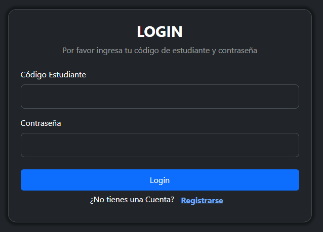
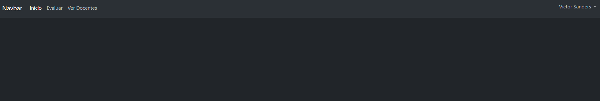
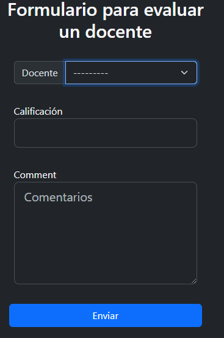
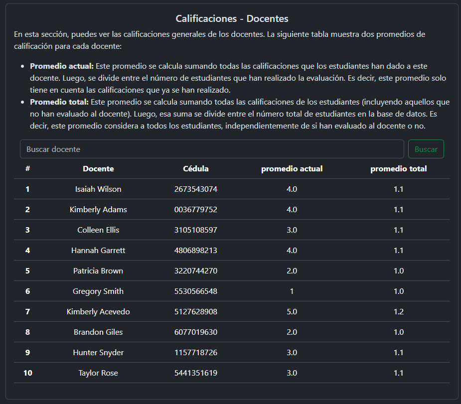
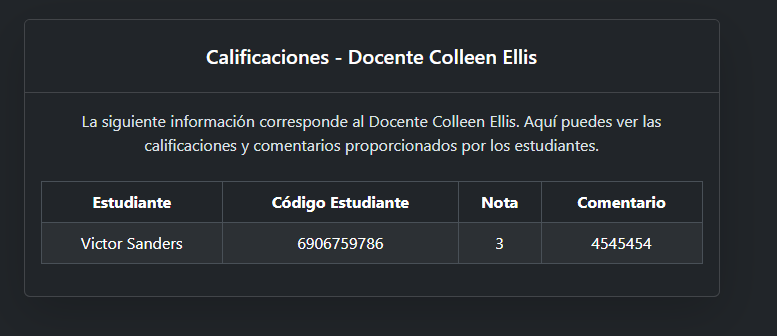

# 📌 Módulo de Evaluaciones - Instalación y Uso

_Esta es la solución para la prueba técnica de Django._
Este proyecto, busca crear una aplicación web sencilla pero eficiente que permite
a los estudiantes evaluar un docente por medio de una calificación y un comentario.
También se desea implementar un formulario para registro e inicio de sesión manteniendo
buenas practicas de código.

## 🛠 Instalación

### - Opción 1: Descargar archivo ZIP

1. **Descargar** el archivo ZIP adjunto en el correo.
2. **Descomprimir** el archivo ZIP.
3. **Abrir el proyecto** con el editor de código que prefiera.

### - Opción 2: Clonar el repositorio

Todos lo realizado para la solución esta en el siguiente repositorio
🔗 [Repositorio GitHub](https://github.com/JulianD1997/modulo_evaluaciones.git)
Para clonar el repositorio, ejecuta los comandos en la terminal:

```bash
# clonar el repositorio
git clone https://github.com/JulianD1997/modulo_evaluaciones.git
# Ingresar a la carpeta del repositorio
cd modulo_evaluaciones
# opcional, abrir el proyecto con vs
code .
```

--

### Creación y activación del entorno virtual

Recomiendo usar un entorno virtual para gestionar las dependencias del proyecto
Comandos para sistemas operativos
**Linux/MacOS**

```bash
# crear entorno virtual
python3 -m venv. venv
# activar entorno virtual
source .venv/bin/active
```

**Windows(CMD)**

```cmd
python -m venv .venv
.venv\Scripts\activate
```

--

### Instalar dependencias, configuracion del proyecto y arranque de servidor

Para el siguiente instalaremos las dependencias que necesita el proyecto

```bash
# instalación del dependencias
pip install -r requirements.txt
# Configuración del proyecto
python manage.py migrate
# Arranque de servidor
python manage.py runserver
```

--

## 🔑 Datos de Importancia

Actualmente en la base de datos del proyecto existen:

- 20 estudiantes
- 10 docentes

Para autenticarse deberá ingresar código de estudiante y contraseña

### Datos de Prueba

- Todos los estudiantes creados para la prueba comparten la misma contraseña
- Puede elegir cualquier **codigo** de la siguiente lista para iniciar sesión.
  | Código de Estudiante | Contraseña |
  |----------------------|------------|
  | 6906759786 | Admin1234+ |
  | 3541964109 | Admin1234+ |
  | 7451321601 | Admin1234+ |
  | 0051899710 | Admin1234+ |
  | 8979795514 | Admin1234+ |
  | 7287476937 | Admin1234+ |
  | 5579318715 | Admin1234+ |
  | 5954741556 | Admin1234+ |
  | 3020943686 | Admin1234+ |
  | 1638611196 | Admin1234+ |
  | 4680451496 | Admin1234+ |
  | 5667079030 | Admin1234+ |
  | 6161497153 | Admin1234+ |
  | 4663424313 | Admin1234+ |
  | 7751370110 | Admin1234+ |
  | 6892247007 | Admin1234+ |
  | 3368082186 | Admin1234+ |
  | 0094005623 | Admin1234+ |
  | 3497095338 | Admin1234+ |
  | 5958584957 | Admin1234+ |
  | 1234567890 | Admin1234+ |

--

## ✏️ Pruebas

### Login(Inicio de sesión)

Acceder al login
Abrir en el navegador y acceder a la ruta:
**http://127.0.0.1:8000** [Localhost:8000](http://127.0.0.1:8000/)

- Acceder a esta ruta sera redirigido automáticamente a la ruta `/login/`
  ya que se requiere autenticación para acceder a otras páginas.
- Vista Login
  
  en la pagina de inicio de sesión, encontraras dos campos:

  1. **Código Estudiante**
  2. **Contraseña**

  Puedes completar los campos con los datos ofrecidos en la parte de arriba
  cuando se llenan ambos campos, dar clip en en el botón **Login**

  - ✅ Si los campos están correctamente → redirige a la pagina de inicio
  - ❌ Si los campos son incorrectos → muestra mensajes indicando el error.

  ### Opcional

  si el estudiante no tiene cuenta puede crear una nueva haciendo clip en **<ins>Registrar</ins>**

--

### Inicio

Acceder desde la barra de navegación o ir a la dirección `http://127.0.0.1:8000/`
pagina de inicio de la aplicación actualmente no tiene contenido, pero en ella se puede
observar una barra de navegación en la parte superior:
Barra de navegación:


- **Inicio** → Página actual.
- **Evaluar** → Para calificar un docente.
- **Ver Docentes** → Para ver un listado de todos los docentes
- **Nombre de estudiante** al hacer clip se desplegara un submenu para cerrar sesión.

--

### Evaluar

Acceder desde la barra de navegación o ir a la dirección `http://127.0.0.1:8000/docente/evaluar/`
Formulario:


- **lista desplegable** en ella se puede seleccionar el docente que se quiere calificar.
  esta lista solo mostrara los docentes que hacen falta por calificar para el estudiante que inicio sesión
- **Calificación** campo para ingresar la nota que desea evaluar en el rango de 1 a 5
- **Comentarios** este Campo es requerido, necesita ingresar un comentario.

cuando se complete el formulario le daremos clip en el botón enviar

- ✅ Si los campos están correctamente → Guarda la evaluación y se actualiza la lista
  desplegable(ya no mostrara el docente calificado)
- ❌ Si los campos son incorrectos → muestra mensajes de error.
  Puede indicar que no se permiten calificaciones menores a 1 o mayores a 5, debe ser un numero entero.
  seleccionar docente, o que el campo de comentarios esta vació.

--

## Ver Docentes

Acceder desde la barra de navegación o ir a la dirección `http://127.0.0.1:8000/docentes/listado/`
Listado docentes:

En esta vista usted podrá observar todos los docentes que están guardados en la base de datos.
esta lista costa de 4 campos.

- **#** ID del docente
- **Docente** Nombre del Profesor
- **Cédula** Cédula del Docente
- **Promedio actual** Promedio actual, suma total de notas divido en el total de
  estudiantes que calificaron hasta el momento
- **promedio total** Promedio total, suma total de notas divido en el total de
  estudiantes en la base de datos, las notas que no se han realizado se toman
  como la nota mas baja posible(1).

Se puede buscar un docente por su nombre o apellido para mayor facilidad,
ademas usted puede darle clip a la fila(casilla) de docente que usted quiera ver las
calificaciones realizadas a ese profesor.

### Ver Evaluaciones

Acceder desde la lista de docentes dando clip en la lista, al docente que desea
observar o ir a la dirección `http://127.0.0.1:8000/docentes/{id}/evaluaciones/` ingresando el id de docente que quiere mirar.
En esta pagina se puede observar toda la información de las calificaciones que
se le realizaron al docente seleccionado.
Listado Evaluaciones:


- **tabla de contenido**
  - **Estudiante** Nombre de estudiante
  - **Código Estudiante** Código del estudiante
  - **Nota** calificación realizada por ese estudiante.
  - **Comentario** Comentario realizado por ese estudiante

En dado caso el docente no haya recibido calificaciones se mostrara un mensaje indicando que No hay evaluaciones disponibles.

--

# 📌 Módulo de Evaluaciones - Documentación de Desarrollo

Este apartado describe el desarrollo de la prueba técnica, su finalidad, configuración,
soluciones implementadas, bloqueos encontradas y mejoras propuestas para futuras versiones.

### Buenas practicas

- se usaron variables en ingles para evitar errores con caracteres especiales del español
- se utilizo el patron **Modelo-Vista-Template** de Django.

--

## ⚙️ Configuración Proyecto principal
Estructura de carpetas
```bash
modulo_evaluaciones/
│── assessment_module/ # carpeta con archivos principales .
│──│── settings.py # configuración del proyecto
│──│── urls.py # Rutas principales del proyecto
│── assessments/
│── templates/
│──│── base_html.html # Plantilla base HTML
│── static/ # Archivos estáticos (CSS, JS)
```

### Entorno virtual

se utilizo un entorno virtual para evitar conflictos con otros proyectos y administrar
las dependencias de manera aislada.

```bash
# crear entorno virtual
python3 -m venv. venv
# activar entorno virtual
source .venv/bin/active
```

### settings.py

- **Registro** de la aplicación en INSTALLED_APPS

  ```python
  INSTALLED_APPS = [
    ...,
      # se agrega proyecto de evaluaciones
      "assessments",
  ]
  ```

- Se utilizo SQLite como base de datos, dado que es un proyecto de prueba, obviamente
  para producción, se recomienda un motor de base de datos mas robusto

  ```python
  DATABASES = {
      "default": {
          "ENGINE": "django.db.backends.sqlite3",
          "NAME": BASE_DIR / "db.sqlite3",
      }
  }
  ```

- Se configuro el sistema de autenticación igualmente para redireccionamientos

  ```python
  # Se cambia el modelo de autenticación por el modelo de Estudiante
  AUTH_USER_MODEL = "assessments.Student"
  # Url para login
  LOGIN_URL = "/login/"
  # Cuando se este abierta la sesión se dirige a la pagina principal
  LOGIN_REDIRECT_URL = "/"
  # Cuando se cierra sesión vuelve a la ruta de Login
  LOGOUT_REDIRECT_URL = "Login"
  ```

- Se definen rutas para templates y archivos estáticos

  ```python
  TEMPLATES = [
      {
        ...,
          # ruta para las carpetas templates
          "DIRS": [
              os.path.join(BASE_DIR, "templates"),
              os.path.join(BASE_DIR, "assessments", "templates"),
          ],...
      }
  ]
  # Se agrega la ruta para los archivos estáticos CSS y JS
  STATICFILES_DIRS = [os.path.join(BASE_DIR, "static")]
  STATIC_URL = "static/"
  STATIC_ROOT = os.path.join(BASE_DIR, "staticfiles")
  ```

  --

### urls.py

- Se incluyen las rutas de las aplicación assessments dentro de las URLs principales
- Como buena practica, cada aplicación debería manejar sus propias rutas. es por ello que se incluyen

```python
urlpatterns = [
    ...,
    # se agrega las rutas de la app de evaluaciones
    path("", include("assessments.urls")),
    ...,
]
```

--

### templates(Platillas)

- Se creo una plantilla base para evitar repetir código en cada vista. Como proyecto
  principal se deja la plantilla base para que pueda tener la misma apariencia.

### static (archivos CSS y JS)

- bloqueo 1: Estilización del Proyecto
  Principalmente había instalado la dependencia Bootstrap para Django, pero algunos
  archivos sobre todo JavaScript no funcionaban correctamente. Para solucionar esto:
  - Descargue los archivos CSS y JSS de Bootstrap.
  - Cargue la carpeta static para garantizar un correcto funcionamiento.

Básicamente esta es la estructura del proyecto principal.

## Aplicación assessments

Estructura de carpetas

```bash
assessments/
│── migrations/ # Migraciones de la base de datos
│── templates/ # Plantillas HTML
│── static/ # Archivos estáticos (CSS, JS)
│── forms.py # Formularios
│── models.py # Modelos de base de datos
│── views.py # Lógica de las vistas
│── urls.py # Rutas de la aplicación
│── tests.py # Pruebas automáticas
```
